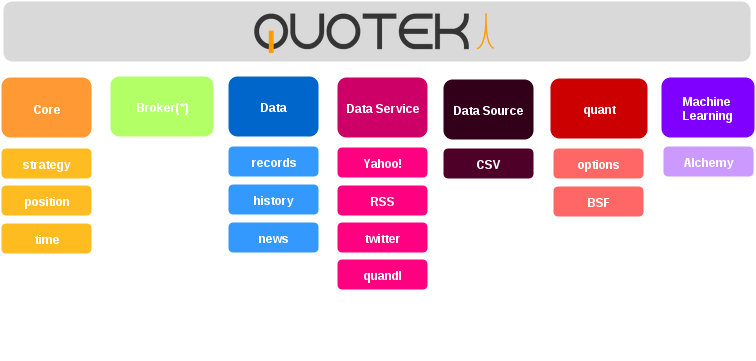

.. Quotek SDK documentation master file, created by
   sphinx-quickstart on Thu Aug  6 02:11:10 2015.
   You can adapt this file completely to your liking, but it should at least
   contain the root `toctree` directive.

Welcome to Quotek SDK documentation!
====================================

Quotek SDK is a set of C++ classes and functions which was created in order to help algo-traders to code fast and efficient strategies in a short amount of time. 

What's in it ?
--------------

You'll find plenty of classes in this SDK, all of them serving multiple purposes. Beyond them you will find 
data source fetching classes, statistical analysis and financial modeling functions, machine learning service clients and algorithms, etc..

The scheme below shows the distribution of functionalities among the namespaces of the SDK: 

.. toctree::
   :hidden:
   :includehidden:
   :titlesonly:

   data_struct
   quant
   ml
   data_sources
   ta
   broker_interact

Now we'll make a short description of each important namespace and what they contain.

Data structures (quotek::data)
^^^^^^^^^^^^^^^^^^^^^^^^^^^^^^

 This is a set of classes which are meant to store structured data, and especially time-series ones.

Qunatitative Analysis (quotek::quant)
^^^^^^^^^^^^^^^^^^^^^^^^^^^^^^^^^^^^^

 The most important category of all, it regroups all the classes and functions needed to process assets historical data from a quantitative perspective.

Machine Learning (quotek::ml)
^^^^^^^^^^^^^^^^^^^^^^^^^^^^^

  This namespace regroups all the classes and functions related to machine learning / deep learning.
  Since this aspect of algo-trading is really promising, expect it to be much deeper in the future.

Data Sources (quotek::datasource)
^^^^^^^^^^^^^^^^^^^^^^^^^^^^^^^^^

  quotek::datasource regroups all the classes which purpose is to fetch data from remote datasources.
  We can for instance think of Yahoo! finance historical data, RSS feeds, etc..

Technical Analysis (quotek::ta)
^^^^^^^^^^^^^^^^^^^^^^^^^^^^^^^

  quotek::ta contains some functions that are meant to compute technical indicators (MACD, RSI, etc..) from historical data.

Broker Interractions (quotek::broker)
^^^^^^^^^^^^^^^^^^^^^^^^^^^^^^^^^^^^^

  The broker class is here to take care of the communication between your trading algo and your broker. This mainly allows to send position orders to your broker.
  
  Note about Broker Interractions: This class is really useful only when used in conjunction with Quotek SaaS.

